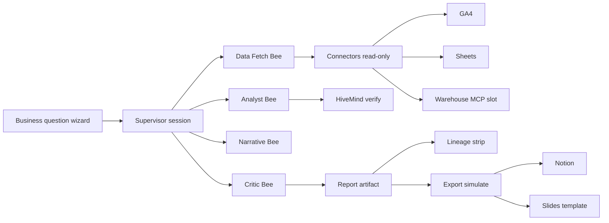

# Business Data Analytics OS

Updated: 2026-06-05

Canonical design for **P10 Track L** — Codex-style business analytics inside Queenswarm without a new persistent swarm colony.

**Signal:** [OpenAI — Codex for data science](https://www.youtube.com/watch?v=Lvk_VZOppIY) — business question → multi-source context → decision-ready report → edit → lineage → export (Slides/templates).

**App domain:** queenswarm.love · **Apps & Tools** workspace (not Agentic OS core).

---

## Decision: session template, not hive colony

| Approach | When | Queenswarm choice |
|----------|------|-------------------|
| **Supervisor session** (2–5 sub-agents) | One-off or operator-triggered reports | ✅ **Default** |
| **Swarm Builder template** | Repeatable preset + skill bundle | ✅ **DA1** |
| **Routine / cron** | Weekly leadership deck | ✅ **DA9** (optional) |
| **New DB sub-swarm colony** | 24/7 independent bee fleet | ⛔ **Not needed** for this feature |

Bee-hive rule: **one bee = one job** inside a **single durable session**, max 5 sub-agents.

---

## Architecture

**Execution engine:** existing supervisor session + Mission Kanban lineage (unchanged).

**Verify:** simulate-first · critic rubric · no live export without operator approve · read-only connectors default.

---

## Sub-agents (one session)

| Bee | Job | Tools / skills |
|-----|-----|----------------|
| **Data Fetch Bee** | Pull metrics for date range + dimensions | `ga4-analytics-playbook` · warehouse MCP · Sheets read |
| **Analyst Bee** | What changed, why it matters, anomalies | HiveMind search · structured tables |
| **Narrative Bee** | Executive summary + chart specs (markdown) | Report templates · optional viz hints |
| **Critic Bee** | Verify numbers cited · flag missing data | `self-review-loop` · rubric ≥4/5 |
| **Export Staging Bee** (optional) | Stage Notion/Slides — simulate only | Notion connector · Slides export lane |

Parallel fetch only when CostGovernor allows; default **sequential** (simpler, cheaper).

---

## Apps & Tools module

| Item | Detail |
|------|--------|
| **Module key** | `analytics_workspace` |
| **Route** | `/apps-tools/analytics` (alias from research workspace) |
| **Capability** | `apps.analytics.decision_report.v1` |
| **Panels** | Question wizard · active report artifact · lineage · export inbox |
| **Snapshot** | `GET /api/v1/analytics-workspace/snapshot` (single BE read) |

Lazy-load panels per [`FEATURE_IMPLEMENTATION_GUARDRAILS.md`](FEATURE_IMPLEMENTATION_GUARDRAILS.md).

---

## Roadmap IDs (Track L)

See [`ROADMAP.md`](ROADMAP.md) P10 Track L for status table.

| Phase | IDs | Deliverable |
|-------|-----|-------------|
| **MVP** | DA1–DA4 | Template + skill + module shell + question wizard |
| **Artifact** | DA5–DA6 | Live report editor + lineage strip |
| **Connectors** | DA7–DA8 | GA4/Sheets/warehouse profile + export simulate |
| **Ops** | DA9–DA12 | Weekly routine · critic loop · snapshot · E2E + manual |

---

## Reused assets (no rebuild)

- `ga4-analytics-playbook` skill
- `POST /research-bee/brief` (qualitative context)
- `POST /agent-os/analysis/consensus` (optional second opinion)
- Supervisor pattern router + critic
- Publish / Notion simulate patterns
- Mission Kanban dispatch + ⌘K recall

---

## Anti-patterns

- Wide-open loop „analyze everything until done“ without turn/cost cap → use **LOOP2**
- Mutating warehouse/GA4 config from agent
- Export with PII without operator review
- Separate analytics hive in DB (Virtual Company style)

---

## Operator workflow (target)

1. **Apps & Tools → Analytics** → enter business question + date range + sources
2. **Dispatch** → supervisor session (template `business-analytics-report`)
3. Review **artifact** + **lineage** in module
4. **Critic score ≥4/5** → approve export to Notion/Slides
5. Optional: save verified flow as **Recipe** for next week

**Local sovereign (LOC13):** When routing mode is `local_sovereign` or `LLM_AIRGAP=1`, analytics bees use Ollama (`analytics_local_sovereign_prefer_enabled`). Overview + Question wizard show **local sovereign** badge.

**Operator manual:** [`OPERATOR_ANALYTICS_WORKSPACE_MANUAL.md`](OPERATOR_ANALYTICS_WORKSPACE_MANUAL.md) · prep: `./scripts/operator-analytics-workspace-prep.sh`

---

## References

- [`OPERATOR_CANONICAL_WORKFLOW.md`](OPERATOR_CANONICAL_WORKFLOW.md)
- [`APPS_TOOLS_MODULE_OWNERSHIP_MAP.md`](APPS_TOOLS_MODULE_OWNERSHIP_MAP.md)
- [`ROADMAP_EXCELLENCE_RECOMMENDATIONS.md`](ROADMAP_EXCELLENCE_RECOMMENDATIONS.md) Track L
- [OpenAI Codex for every role](https://openai.com/index/codex-for-every-role-tool-workflow/)
