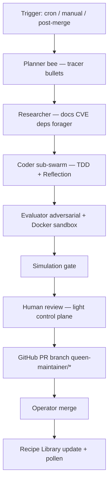

# Harness & Self-Maintaining Swarm — Video Analysis + Roadmap

Updated: 2026-05-21  
Sources: Langfuse (Klingen), Anthropic codebase harness (Medin), Matt Pocock workflow, AnswerThis self-evolving agent, Anthropic long-running agents (Ash & Andrew).

Cross-links: `docs/QUEENSWARM_DESIGN_PATTERNS.md` · `docs/ROUNDTABLESPACE_MAY2026_INSIGHTS.md`

## Verdikt

Všetkých **5 videí potvrdzuje náš smer** (harness > model, verified loop, layered memory). Queenswarm už má **viac integrácie než každý jednotlivý nástroj vo videách** — chýba:

1. **Viditeľný harness** (AI Layer Dashboard)
2. **Behavioral memory** (`instructions.md` editovateľné operátorom)
3. **Queen Maintainer** — PR-only self-maintaining swarm (AnswerThis + Anthropic Ralph loop)
4. **Forager intelligence loop** — auto-refresh skills + MCP + integration docs

**Nerobiť:** priamy write do `main`, obídenie simulácie, monolitický rules súbor, fork cudzích harnessov.

---

## Video 1 — Langfuse: Skilling up coding agents (Marc Klingen)

**Takeaway:** Skills ako search endpoint + references (nie copy-paste docs). Auto-research loop na skilloch.

| U nás | Status |
|-------|--------|
| Markdown skills + `SkillLibrary.select_for_task()` | ✅ Live |
| Recipe Library + verified workflows | ✅ Live |
| Skill references / lazy fetch | 🟡 Partial — skills loaded whole, nie search endpoint |
| Auto-research on skills | ⏳ Planned |

**Naše vylepšenie (edge vs Langfuse):**

| Feature | Popis | Priorita | Est. |
|---------|-------|----------|------|
| **Skill reference mode** | Skill vracia URL/section pointer; forager fetchne fresh docs on demand | P1 | 2–3 d |
| **Auto-Skill Researcher** | Daily forager: scan integration docs → propose skill diffs → Hive Mind graph | P1 | 3–5 d |

**Zlučuje sa s Fáza 4:** Tool Discovery Loop — jeden **Forager Intelligence Loop** (MCP + skills + docs).

---

## Video 2 — Anthropic: Harness for large codebases (Cole Medin)

**Takeaway:** Harness > model. Layered global rules. Scoped skills. LSP + MCP. Sub-agents. Self-improving hooks.

| U nás | Status |
|-------|--------|
| Layered rules | 🟡 `.cursorrules` + `.cursor/rules/*.mdc` — chýba per-module `AGENTS.md` |
| MCP connectors | ✅ Dynamic hub + marketplace |
| Sub-agents / sub-swarms | ✅ Supervisor + Phase 6 |
| Self-improving hooks | ✅ Rapid loop, imitation, pollen, Pattern Router |
| LSP integration | ❌ Not yet |
| Harness visibility dashboard | ❌ Not yet |

**Roadmap:**

| Feature | Popis | Priorita | Est. |
|---------|-------|----------|------|
| **Layered harness docs** | Root `AGENTS.md` + `backend/AGENTS.md` + `frontend/AGENTS.md` | P1 | 1–2 d |
| **AI Layer Dashboard** | `/settings/harness` — rules layers, active skills, MCP tools, pattern stack | P1 | 4–5 d |
| **LSP + MCP bridge** | Symbol-aware context for coder sub-agent (optional) | P2 | 5–7 d |

---

## Video 3 — Matt Pocock: Full AI coding workflow

**Takeaway:** Ambiguous req → PRD → Kanban → tracer bullets → TDD agent → autonomous runs → human review.

| U nás | Status |
|-------|--------|
| PRD / product decomposition | 🟡 `product-mission.md` skill, Swarm Builder |
| TDD pattern | ✅ `tdd.md` skill + Pattern Bible |
| Task / Kanban hub | ✅ `/tasks` |
| Tracer bullet slices | ⏳ Not explicit in UI |
| Human review | ✅ `needs_input`, playbook approve |

**Roadmap:**

| Feature | Popis | Priorita | Est. |
|---------|-------|----------|------|
| **Tracer bullet decomposer** | Workflow Breaker outputs vertical slices → tasks auto-create | P2 | 3–4 d |
| **PRD → Kanban template** | Swarm Builder template „Product Ship“ | P2 | 2 d |

**Poznámka:** Nižšia priorita než Queen Maintainer — väčšina flow už existuje.

---

## Video 4 — AnswerThis: Self-evolving internal agent ($2M ARR)

**Takeaway:** Self-extending tools. 3 memory types. Non-tech founder trains via Slack → `instructions.md`.

| Memory type | Queenswarm mapping | Status |
|-------------|-------------------|--------|
| **Factual** | Hive Mind, codebase graph, Obsidian vault | ✅ |
| **Behavioral** | Curated memory, tenant prompts | 🟡 No editable `instructions.md` UX |
| **Procedural** | Recipes, tools, MCP manifests | ✅ |
| **Self-extending tools** | Plugins + dynamic MCP install | 🟡 Partial |
| **Slack feedback loop** | Phase 3 connectors (Slack template) | 🟡 Connector exists, no training UX |

**Roadmap:**

| Feature | Popis | Priorita | Est. |
|---------|-------|----------|------|
| **Behavioral memory UX** | Tenant `instructions.md` editor in Settings (AnswerThis-style) | P1 | 3–4 d |
| **Self-extending tool flow** | New task → coder proposes MCP/plugin → simulate → marketplace | P2 | 5 d |
| **Slack harness trainer** | Feedback message → append behavioral memory (Pro+) | P2 | 4 d |

---

## Video 5 — Anthropic: Agents that run for hours (Ash & Andrew)

**Takeaway:** Ralph loop, structured handoffs, generator-evaluator, rubrics, checkpoints, planner role.

| Pattern | Queenswarm | Status |
|---------|------------|--------|
| Ralph loop | Durable supervisor + Celery steps | ✅ |
| Structured handoffs | Session events + context_summary | ✅ |
| Generator-evaluator | Critic sub-agent + simulations | ✅ |
| Rubrics | `evaluation_criteria` on workflow steps | ✅ |
| Checkpoints | Session state, playbook save | 🟡 Partial |
| Planner role | Goal orchestrator, routines | ✅ |

**Roadmap:**

| Feature | Popis | Priorita | Est. |
|---------|-------|----------|------|
| **Checkpoint resume UI** | Resume durable session from last verified step | P2 | 3 d |
| **Rubric templates** | Subjective output scoring (design, copy) | P2 | 2 d |

**Väčšina už live** — Queen Maintainer použije tento stack priamo.

---

## Queen Maintainer — Self-maintaining codebase swarm

**Áno, stojí to za to** — ale **len PR-only, simulate-first, scoped permissions**.

### Architektúra

### Triggers

| Trigger | Mechanism |
|---------|-----------|
| Weekly cron | `SupervisorRoutine` + Celery |
| Manual | „Review tech debt“ / „Update dependencies“ in Command Center |
| Event | Webhook post-merge (GitHub connector) |

### Bezpečnosť (non-negotiable)

- ❌ No direct write to `main` or production DB
- ✅ PR-only via `github_rest` Phase 3 template (`pulls_*` tools)
- ✅ Docker sandbox (`hive_ephemeral_sandbox.py`) — 256MB, network none, 30s
- ✅ Scoped denylist: `.env*`, billing, security routers, `docker-compose.prod.yml`
- ✅ Audit log + session recording (existing)
- ✅ CostGovernor + rate limits
- ✅ Human approval before merge

### Implementačné fázy

| Phase | Deliverable | Est. | Status |
|-------|-------------|------|--------|
| **P0 stub** | `queen-maintainer.md` skill + `docs/harness/QUEEN_MAINTAINER_INSTRUCTIONS.md` | 1 d | ✅ |
| **P1a** | Maintainer Supervisor routine (weekly cron) | 2–3 d | ⏳ |
| **P1b** | GitHub PR workflow (branch + PR create, no merge) | 3–4 d | ⏳ |
| **P1c** | Tech Health Dashboard (deps, coverage, perf budget) | 4–5 d | ⏳ |
| **P2** | Event trigger post-merge + checkpoint resume | 3 d | ⏳ |

**User estimate „1 týždeň P0“** → realisticky **P1a+b = 5–7 dní solo** po operator Stripe unblock.

---

## Consolidated priority (all videos)

| Priority | Item | Source video(s) | Est. |
|----------|------|-----------------|------|
| **P1** | Queen Maintainer routine + PR workflow | AnswerThis, Anthropic | 5–7 d |
| **P1** | Forager Intelligence Loop (skills + MCP + docs) | Langfuse, Fáza 4 | 4–6 d |
| **P1** | Layered harness (`AGENTS.md` hierarchy) | Anthropic Medin | 1–2 d |
| **P1** | AI Layer Dashboard | Anthropic Medin | 4–5 d |
| **P1** | Behavioral memory editor (`instructions.md`) | AnswerThis | 3–4 d |
| **P1** | Tech Health Dashboard | Queen Maintainer | 4–5 d |
| **P2** | Skill reference / lazy doc fetch | Langfuse | 2–3 d |
| **P2** | Tracer bullet → Kanban auto-slice | Pocock | 3–4 d |
| **P2** | LSP + MCP bridge | Anthropic | 5–7 d |
| **P2** | Slack harness trainer | AnswerThis | 4 d |
| **P2** | Self-extending tool marketplace flow | AnswerThis | 5 d |

---

## Queenswarm edge (marketing — accurate)

> **One hive, full harness:** layered rules, 20 agentic patterns, persistent Hive Mind, verified simulations, and a Queen Maintainer that opens PRs — never raw commits to production.

---

## References

- `backend/app/skills/queen-maintainer.md` — Maintainer bee skill
- `docs/harness/QUEEN_MAINTAINER_INSTRUCTIONS.md` — behavioral memory template
- `backend/app/infrastructure/connectors/phase3/catalog.py` — `github_rest` template
- `backend/app/application/services/hive_ephemeral_sandbox.py` — simulation sandbox
- `docs/QUEENSWARM_DESIGN_PATTERNS.md` — TDD, Reflection, Planning patterns
