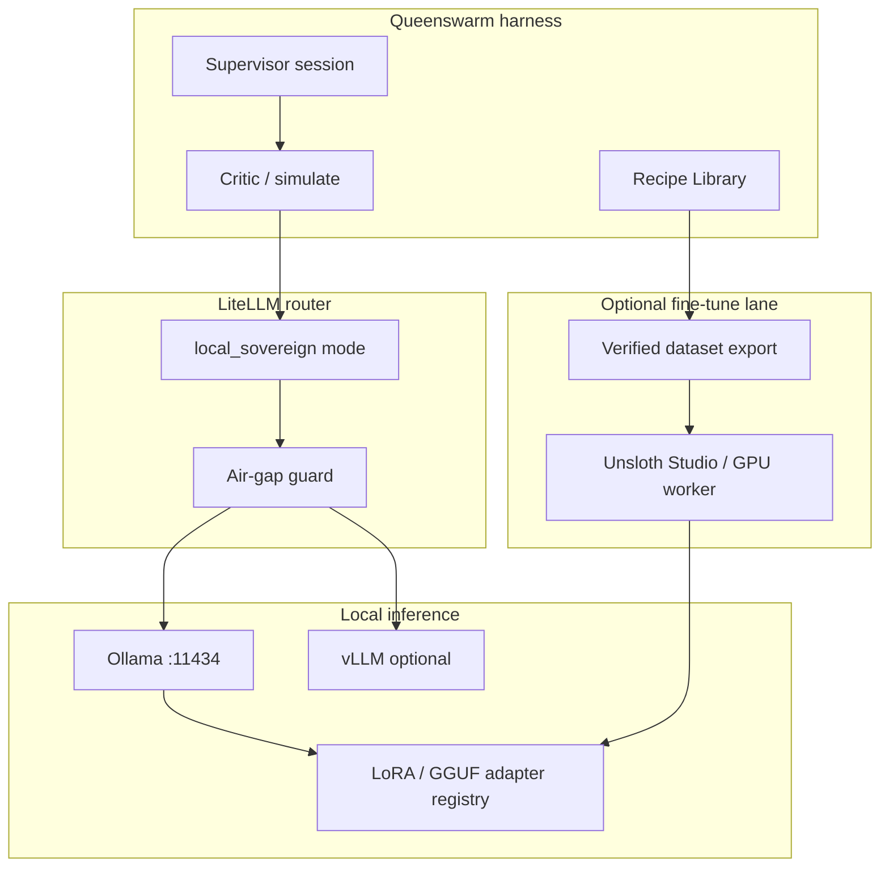

# Local Sovereign LLM OS

Updated: 2026-06-05

Canonical design for **P10 Track M** — run Queenswarm on **PC/server without external LLM APIs**, inspired by local fine-tune stacks (Unsloth Studio) while keeping verify-first harness.

**Signal:** [David Ondrej — Unsloth Studio fine-tune locally](https://www.youtube.com/watch?v=BFH9D05UFvM) — QLoRA on own hardware · Recipes (PDF→dataset) · GGUF/Ollama export · optional teacher API for distillation.

**Queenswarm stance:** **Inference air-gap capable** · dataset from **verified swarm outputs** · fine-tune **operator-approved** · Unsloth as **optional bridge**, not a second app.

---

## Goal

| Requirement | Solution |
|-------------|----------|
| App runs without OpenAI/Anthropic/Grok | LiteLLM → **Ollama / vLLM / llama.cpp** |
| Custom domain model (finance, ops, SK copy) | **LOC5–9** dataset + adapter registry |
| Same harness (sessions, critic, recipes) | No rewrite — **routing + adapters only** |
| PC + dedicated server | Docker `local-llm` profile + bare-metal scripts |
| Privacy / air-gap | `LLM_AIRGAP=1` blocks cloud hops |

**Not in scope:** shipping 50GB weights in repo · autonomous fine-tune without operator · distilling paid APIs without ToS review.

---

## Architecture



**Execution:** existing bees call `LiteLLMRouter` unchanged; router selects `ollama/qwen2.5:7b` (example) when `routing_mode=local_sovereign`.

---

## Modes

| Mode | Cloud LLM | Local LLM | Use case |
|------|-----------|-----------|----------|
| `cloud` (default prod) | ✅ primary | optional fallback | queenswarm.love today |
| `free_first` | economy cloud | — | solo €0 target |
| **`local_sovereign`** | ⛔ blocked | ✅ only | PC/server air-gap |
| `hybrid_distill` | teacher for **dataset only** (HITL) | student inference | one-time recipe build |

Video uses OpenRouter for recipe teacher calls — we expose **`hybrid_distill`** only with **operator approve + budget cap**; default sovereign path uses **local teacher** (smaller model) or **manual curation**.

---

## Track M roadmap IDs

See [`ROADMAP.md`](ROADMAP.md) P10 Track M.

| Phase | IDs | Deliverable |
|-------|-----|-------------|
| **Inference MVP** | LOC1–LOC4, LOC11 | Ollama in LiteLLM + UI + air-gap |
| **Data & adapters** | LOC5–LOC6, LOC8 | Verified JSONL export + adapter registry |
| **Fine-tune lane** | LOC7, LOC9–LOC10 | Unsloth bridge + GPU job queue |
| **Integration** | LOC12–LOC14 | E2E, Analytics DA local, Recipe tags |

---

## Verified dataset (Queenswarm moat vs raw PDF distill)

Export only:

- Critic-**APPROVED** session deliverables  
- Verified **Recipe Library** steps  
- Operator-curated memory (no secrets)  
- Optional: PDF → Q&A via **local** model in LOC6  

Format: instruction / input / output JSONL (Alpaca-compatible) for Unsloth/Hugging Face.

---

## Hardware profiles

| Profile | RAM/VRAM | Suggested model | Training |
|---------|----------|-----------------|----------|
| **Laptop** | 16–32 GB | 7B–9B GGUF Q4 | QLoRA small steps |
| **Workstation** | 48–128 GB | 27B Q4 / 9B full | QLoRA + recipes |
| **Server GPU** | 24GB+ VRAM | vLLM 14B–32B | Celery GPU worker LOC9 |

Preflight: `scripts/operator-local-llm-preflight.sh` (VRAM, Ollama ping, disk).

---

## Docker (target)

```yaml
# docker-compose.local-llm.yml (profile local-llm)
services:
  ollama:
    image: ollama/ollama:latest
    ports: ["11434:11434"]
    volumes: [ollama_models:/root/.ollama]
  # backend env:
  #   OLLAMA_API_BASE=http://ollama:11434
  #   LLM_ROUTING_MODE=local_sovereign
  #   LLM_AIRGAP=1
```

Backend stays one process; **no** Unsloth inside API container (GPU isolation).

---

## Operator workflow

1. `./scripts/operator-local-llm-preflight.sh`
2. `docker compose --profile local-llm up -d ollama` + pull model  
3. Settings → **Local Inference** → test ping → enable **local_sovereign**  
4. Run supervisor session — critic still required  
5. (Optional) Export verified dataset → Unsloth train → register adapter LOC8  
6. Point router at `ollama/my-tenant-adapter:latest`

---

## Anti-patterns

- Cloud fallback when `LLM_AIRGAP=1` (must hard-fail with clear error)  
- Fine-tune on unverified session dumps  
- Running Unsloth inside FastAPI worker (GPU/memory collision)  
- Replacing simulation gate because „local = safe“

---

## References

- [Unsloth Studio docs](https://unsloth.ai/docs/new/studio/start.md)  
- [`backend/app/core/llm_router.py`](../backend/app/core/llm_router.py)  
- [`docs/BUSINESS_DATA_ANALYTICS_OS.md`](BUSINESS_DATA_ANALYTICS_OS.md) — DA bees on local models  
- [OpenAI local stack convergence (llama.cpp / HF)](https://unsloth.ai/docs/new/studio/install)
