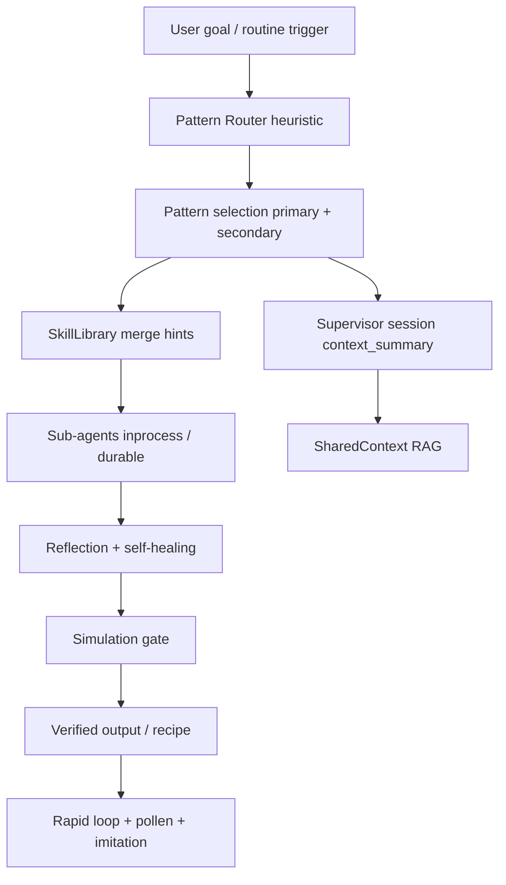

# Queenswarm Agentic Design Patterns

Updated: 2026-05-21  
Source: industry catalog (incl. Mark Kashef — *Master ALL 20 Agentic AI Design Patterns*, Sept 2025)  
Implementation: **Pattern Router** (`pattern_router.py`) + existing Supervisor stack.

## TL;DR

Queenswarm **already implements ~14/20 patterns** in production code. The gap is not architecture — it is **explicit pattern selection, visibility, and forced reflection gates**.

| Layer | Status |
|-------|--------|
| Pattern Router (heuristic) | ✅ P0 shipped — `select_patterns_for_task()` |
| Forced reflection skills | ✅ `supervisor_forced_reflection_enabled` |
| Pattern Bible (this doc) | ✅ |
| Pattern Explorer UI | ✅ |
| AI-driven pattern router | ✅ P2 shipped (flag OFF — enable after telemetry baseline) |
| Pattern success metrics | ✅ Prometheus + Grafana + Alertmanager |

Marketing line (accurate): **Queenswarm orchestrates verified swarms using 20 industry-standard agentic design patterns — with persistent Hive Mind, not stateless harnesses.**

---

## Pattern catalog → Queenswarm mapping

| # | Pattern | Queenswarm today | Gap / next |
|---|---------|------------------|------------|
| 1 | **Prompt Chaining** | Workflow Breaker decomposition, playbook steps | Tag recipes with pattern stack |
| 2 | **Routing** | LiteLLM router, SkillLibrary, Pattern Router | Free-First mode (Fáza 4) |
| 3 | **Parallelization** | Multi sub-agent spawn, Celery durable steps | Merge coordinator UX |
| 4 | **Reflection** | `meta_reasoning.py`, `self-review-loop` skill, self-healing | ✅ Forced on all sessions (P0) |
| 5 | **Tool Use** | MCP hub, dynamic tool catalog, browser harness | Venice preset (Fáza 4) |
| 6 | **Planning / Orchestration** | Supervisor sessions, Goal Orchestrator, routines | Pattern Router ✅ |
| 7 | **Multi-Agent Collaboration** | Sub-agents by role, inter-agent events | Pattern Explorer (P1) |
| 8 | **Memory Management** | Session short memory, Dreaming long-term, Hive Mind RAG | Episodic layer explicit (P1) |
| 9 | **Learning & Adaptation** | Rapid loop, imitation engine, pollen, LearningLog | Policy update step (P1) |
| 10 | **Goal Setting & Monitoring** | Goal orchestrator, routine triggers, autonomy state | Tie to Pattern Router scores |
| 11 | **Exception Handling** | Self-healing retries, sandbox, error classification | Smart fallback taxonomy (P1) |
| 12 | **Human-in-the-Loop** | `needs_input` status, approval flow, light control plane | Smarter cue timing (P1) |
| 13 | **RAG / Retrieval** | `SharedContextService`, hive-mind search/graph | Selective recall (Fáza 4) |
| 14 | **Inter-Agent Communication** | Supervisor session events, WS live pulse | — |
| 15 | **Resource-Aware Optimization** | CostGovernor, CostRecord ledger | Free-First routing (Fáza 4) |
| 16 | **Reasoning** | Multi-step skills, meta-reasoning journal | Debate role optional (P2) |
| 17 | **Guardrails** | Simulation gate, evaluation_criteria, verified-only UX | — |
| 18 | **Prioritization** | Task queue, routine scheduling, pollen ranking | Overnight triage (Dump & Sleep) |
| 19 | **Exploration** | Foragers, initiative proposals | Tool Discovery Loop (Fáza 4) |
| 20 | **Evaluation / Monitoring** | Rapid loop widget, cockpit telemetry, Grafana | Pattern success % (P2) |

---

## Pattern Router (P0 — shipped)

At every `create_supervisor_session()`:

1. `select_patterns_for_task(goal, roles)` — **heuristic, no LLM cost**
2. Patterns stored in `context_summary.agentic_patterns`
3. Skill hints merged (`self-review-loop`, `multi-step-reasoning`, …)
4. Event `session_created` includes pattern payload
5. Sub-agents receive `pattern_prompt_block` in short memory

Config (`settings`):

```python
supervisor_pattern_router_enabled = True      # master switch
supervisor_forced_reflection_enabled = True # pattern #4 always on
```

### Example selections

| Goal signal | Primary patterns |
|-------------|------------------|
| Multi-step report | planning, prompt_chaining, reflection, RAG |
| Parallel batch work | parallelization, multi_agent, tool_use |
| Ambiguous objective | exploration, goal_monitoring, human_in_the_loop |
| Production / payment | human_in_the_loop, guardrails, reflection |

---

## Forced reflection gate (Pattern 4)

**Critic → Revise → Validate** before verified output:

- `self-review-loop` + `meta-reasoning-reflection` skills auto-selected
- Self-healing runtime (`supervisor_self_healing_enabled`) retries with meta-reasoning journal
- Simulation gate blocks raw outputs from reaching users

Target: **30–50 % hallucination reduction** on complex tasks (industry benchmark — measure via simulation pass rate).

---

## Memory layers (Pattern 8)

| Layer | Queenswarm store | TTL |
|-------|------------------|-----|
| Short-term | `SubAgentSession.short_memory`, session context | Session |
| Episodic | Supervisor session events + DreamCycle insights | 30–90 d |
| Long-term | Neo4j graph, pgvector, Obsidian vault, curated memory | Persistent |

**Combo with Fáza 4:** Dump & Sleep → overnight episodic ingest → compressed graph nodes.

---

## Learning loop (Pattern 9)

```
task → simulate → reflect → pollen reward → recipe save → imitation
```

**P1 add:** `policy_update` — after verified task, append best-practice delta to tenant curated memory.

---

## Orchestration recipes (P1)

Tag Recipe Library entries with pattern stacks:

| Template | Pattern stack |
|----------|---------------|
| Exec Assistant | planning + RAG + reflection + goal_monitoring |
| Lead Waterfall | parallelization + tool_use + human_in_the_loop |
| Life OS | memory + prioritization + reflection + planning |
| Research Swarm | RAG + reasoning + exploration + reflection |

---

## Architecture diagram



---

## Roadmap (implementation)

| Priority | Item | Est. | Status |
|----------|------|------|--------|
| **P0** | Pattern Bible + Pattern Router + forced reflection | 1–3 d | ✅ |
| **P1** | Pattern Explorer dashboard panel | 3–4 d | ⏳ |
| **P1** | Orchestration recipe pattern tags | 2 d | ⏳ |
| **P1** | Rapid loop: best-pattern telemetry | 2 d | ⏳ |
| **P1** | Episodic memory explicit API | 3 d | ⏳ |
| **P2** | LLM-driven pattern router hop | 2 d | ⏳ |
| **P2** | Pattern success rate metrics | 2 d | ⏳ |
| **P2** | Onboarding: „Your swarm used 5 patterns today“ | 2 d | ✅ |

---

## Skills reference

Pattern-specific skill markdown lives in:

- `backend/app/skills/` — runtime skills (self-review-loop, meta-reasoning-reflection, …)
- `backend/app/skills/patterns/` — pattern TL;DR index (optional deep dives)

Pattern Router code: `backend/app/application/services/supervisor/pattern_router.py`

Queen Maintainer API: `GET/PUT /api/v1/queen-maintainer/*` — see `docs/HARNESS_SELF_MAINTAINING_ANALYSIS.md`

Tests: `backend/tests/test_supervisor_pattern_router_unit.py`

---

## References

- `docs/ROUNDTABLESPACE_MAY2026_INSIGHTS.md` — viral product features (Dump & Sleep, Free-First)
- `docs/MISSION_EXECUTION_BACKLOG.md` — Fáza 5 agentic patterns
- `docs/ROADMAP.md` — P5 table
- `backend/app/application/services/supervisor/meta_reasoning.py`
- `backend/app/domain/learning/reflection_loop.py`
